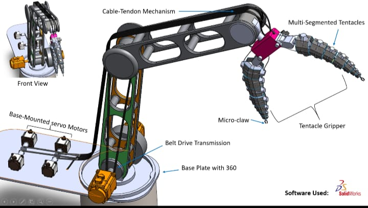
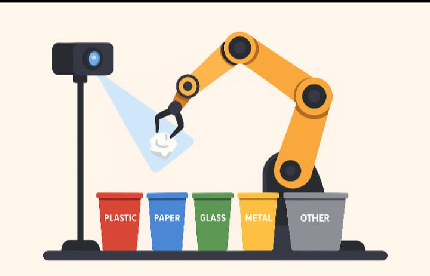
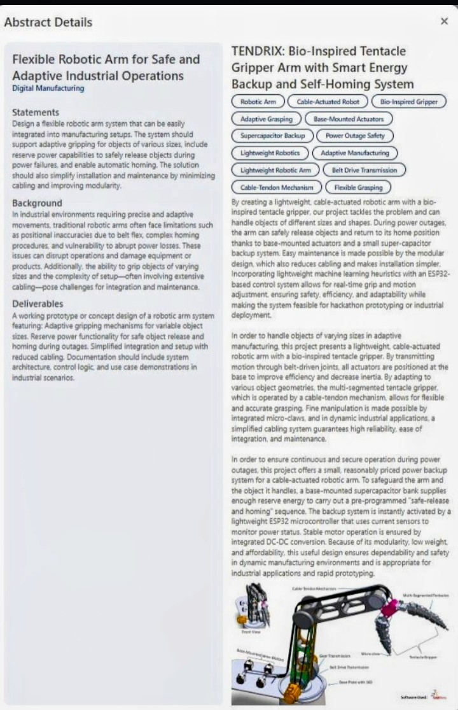

# TENDRIX — Bio-Inspired Tentacle Gripper Robotic Arm

<p align="center">
  
</p>

<h1 align="center">TENDRIX</h1>

<h3 align="center">
  Bio-Inspired Adaptive Robotic Arm with ML-Assisted Manipulation & Emergency Safe Homing
</h3>

<p align="center">
  L&T Techgium Hackathon Finalist • Industrial Robotics • Computer Vision • Machine Learning • Embedded Systems • Safety Engineering
</p>

<p align="center">
  
  
  
  
  
</p>

---

## Project at a glance

TENDRIX is a **bio-inspired cable-tendon robotic arm** designed for **safe, adaptive industrial manipulation**.

The system combines:

- A multi-segment **tentacle-inspired gripper**
- **Cable-tendon actuation** for lightweight adaptive manipulation
- **Computer vision and machine-learning-assisted grasping**
- A **power-loss emergency control system**
- **Supercapacitor-backed emergency operation**
- Controlled payload release and **safe autonomous homing**

The central idea is simple:

> **Make industrial manipulation more adaptive like biology, while making failure recovery more deliberate and safety-centric.**

---

# Project leadership

<p align="center">
  
</p>

<h2 align="center">Sayantani Banerjee</h2>

<h4 align="center">Project Team Lead • Systems Integration Lead • AI & Robotics Researcher</h4>

<p align="center">
  Founder of SHUDDH • Computer Vision • Embedded Systems • Sustainable Automation • Research & Innovation
</p>

<p align="center">
  <a href="https://github.com/Sayantani9">
    
  </a>
  <a href="https://www.linkedin.com/in/g-sayantani-mb-65337230b/">
    
  </a>
  <a href="mailto:smb.workspace9@gmail.com">
    
  </a>
</p>

---

# TENDRIX in action

<p align="center">
  
  
</p>

<p align="center">
  
  
</p>

<p align="center">
  <i>Prototype views of the TENDRIX robotic arm and bio-inspired gripper.</i>
</p>

### Demonstration videos

- [Robotic Arm Hero Demonstration](robotic-arm-hero-video.mp4)
- [Robotic Arm Hero Demonstration — Alternate](robotic-arm-hero-video2.mp4)
- [Robotic Arm Demonstration](robotic-arm-video.mp4)

---

# Executive summary

TENDRIX is a **bio-inspired cable-tendon robotic arm** designed for **safe adaptive industrial manipulation**.

The system combines a **multi-segment tentacle gripper**, **computer vision**, **machine-learning-assisted grasping**, and an **emergency power-loss safe homing system** that enables controlled object release and automatic return to a safe position during unexpected power failures.

Unlike conventional robotic manipulators that may abruptly stop or drop payloads during electrical failures, TENDRIX introduces a **supercapacitor-backed emergency landing control architecture** capable of executing a safe descent, controlled object release, and autonomous homing sequence.

The project focuses on:

- Industrial safety
- Adaptive manipulation
- Modular robotics
- Intelligent automation
- Embedded emergency control

---

# L&T Techgium recognition

TENDRIX was developed and presented as an **L&T Techgium Hackathon Finalist**, addressing a real industrial challenge in manufacturing automation:

> **How can robotic manipulators safely handle unexpected power outages while maintaining adaptive grasping capability for objects of varying geometry and fragility?**

---

# The industrial problem

Modern manufacturing environments use robotic manipulators for:

- Fragile components
- Irregular industrial parts
- Packaging materials
- Precision assemblies
- Glass products
- Electronic modules

A sudden power outage can cause:

- Uncontrolled arm stoppage
- Payload dropping
- Collision with nearby equipment
- Production damage
- Operator safety hazards
- Recovery downtime

Traditional robotic systems can require complex recovery procedures and additional safety hardware.

**TENDRIX addresses this challenge by combining mechanical adaptability with intelligent emergency control.**

---

# Key innovations

## 1. Bio-inspired tentacle gripper

The end-effector is inspired by **octopus tentacle mechanics**, allowing the gripper to conform around objects rather than relying solely on rigid contact points.

### Advantages

| Capability | Benefit |
|---|---|
| Adaptive surface contact | Better conformity to object geometry |
| Improved grip stability | More reliable manipulation |
| Irregular geometry handling | Wider object compatibility |
| Reduced contact pressure | Safer handling of fragile objects |
| Multi-point contact | Improved grasp distribution |
| Modular segments | Easier experimentation and replacement |

---

## 2. Cable-tendon actuation

Instead of mounting heavy actuators directly near the gripper, TENDRIX uses a **cable-tendon transmission architecture**.

### Benefits

- Reduced moving inertia
- Faster dynamic response
- Lower end-effector weight
- Improved energy efficiency
- Simplified maintenance
- Modular actuation

---

# System architecture

<p align="center">
  
</p>

### Main manipulation pipeline

```text
Camera
   ↓
Computer Vision
   ↓
Object Classification
   ↓
Grasp Planner
   ↓
Motion Controller
   ↓
Cable-Tendon Arm
   ↓
Bio-Tentacle Gripper
